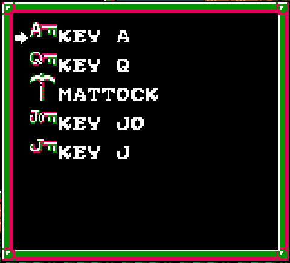
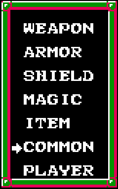
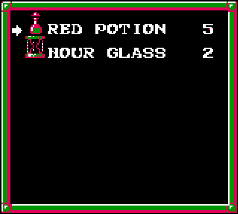

> [!IMPORTANT]  
> Daxanadu is not a clone, a remake nor a source port. Daxanadu is an NES emulator that only works with a Faxanadu rom file. You must own a legal copy of that rom. I will not provide it for you, so don't ask.


# DAXANADU

Daxanadu stands for "Daivuk's Xanadu". It is a patched version of Faxanadu for the NES. It is not a clone or a remake, but rather it is an NES emulator tailored for Faxanadu. To run the game, you will need to put the Faxanadu rom file into the same folder as Daxanadu. The rom must be the English version. Rename it to exactly: `Faxanadu (U).nes`. The other US version with the fixed font might work, but I have not tested it as I do not own a copy of this version.

Daxanadu dynamically patches the rom as the game run to allow for easy option menus that toggle the options in runtime.

## New features
Here is the list of improvements, options and features that Daxanadu brings to Faxanadu.
- Meditating saves state instead of showing a password.
- "Continue" game loads save state instead of asking for password.
- Rebindable inputs.
- Separated adjustable volume for music and sfx.
- Various gameplay options, [see the Options section for more details](#Options).
- Archipelago support, [see Archipelago section for more details](#Archipelago).

## Options
### Gameplay options
- `DIALOG SPEED`: Increases NPCs dialog speed.
- `KEEP GOLD ON DEATH`: Don't reset gold to your level when dying.
- `KEEP XP ON DEATH`: Don't reset xp to your level when dying.
- `DOUBLE GOLD`: Double gold reward from enemies.
- `DOUBLE XP`: Double xp reward from enemies.
- `KING GOLDS`: Fix the issue where the king can give you 1500 "golds" more than once.
- `COINS DESPAWN`: Allow coins to stay indefinitely on screen like bread.
- `EQUIP IN SHOPS`: Allow to equip inventory in shops.
- `ITEM ROOM COUNTER`: Reduce item room counter to 1. Certain "secret" items only appear after killing all enemies in the room, if the counter is exactly 4. Forcing the player to attempt up to 4 times.
- `XP AFFECTS WINGBOOTS`: Wingboots always last 40 seconds.
- `XP AFFECTS SPEED`: Character speed is always at max.
- `FIX PENDANT`: Reverse the pendant effect. Starting weak and getting strong once finding the pendant.

### Visual options
- `MIST SCROLL`: All fog sprites are animated at different speed for a slight parallax effect.
- `CIGARETTES`: Remove cigarettes and smoke from NPCs.
- `LEVEL NAME POPUP`: Show a popup at the top of the screen when entering an area, telling its name.

### New game options
- `START FULL HEALTH`: Starts the game with full health and full mana.

## Save states
You can at all time save a state using LEFT CTRL + number from 1 to 9. To load a state, press a number from 1 to 9.

## Controllers
Note that for now, only the XBOX controller through XInput is supported. Mouse and keyboard are also supported.
I have plans to support more controllers through SDL2 in the future.

## Archipelago
For details about Archipelago, please visit: [archipelago.gg](https://archipelago.gg/)

### Recommented settings
While playing Archipelago, it is recommended to enable `DOUBLE GOLD` from the game options. It will help reduce the grind.
The recommended YAML settings are:
```yaml
  keep_shop_red_potions:
    false: 0
    true: 50

  include_pendant:
    false: 50
    true: 0

  include_poisons:
    false: 50
    true: 0

  require_dragon_slayer:
    false: 0
    true: 50
```

### Items
in AP mode, item inventory is handled differently than the original game.

#### Unique items
Various items in the game are now unique. Similar to rings, pendant and magical rod.
They can be selected under the ITEM inventory submenu.



Any items in there are re-usable. For example: Once you got the KEY J, you have it for ever. You still need to equip it to use it. The list of item that are now unique and end up in that menu:

- KEY J
- KEY Q
- KEY K
- KEY A
- KEY JO
- MATTOCK
- SPRING ELIXIR

The SPRING ELIXIR is a new item that is used to flow the spring in the Tower of Fortress. You still can get a normal Elixir and those work normally. Its color is green instead of red:


There is also a new item called UNLOCK BOOTS. (AP's name: "Unlock Wingboots"). There are Wingboots in various shops. They are LOCKED by default and cannot be bought until you get this item.

#### Common items
For consumable items, a new submenu was added called COMMON:



In this category, items are stackable.



The list of common items are:

- RED POTION
- HOUR GLASS
- OINTMENT
- GLOVE
- WINGBOOTS

Ointment and Gloves are now equipable and can be activated when desired.


### Location Checks

The full list of locations:

#### Eolis
- Eolis Guru
- Eolis Key Jack
- Eolis Hand Dagger
- Eolis Red Potion
- Eolis Elixir
- Eolis Deluge

#### Path to Apolune
- Path to Apolune Magic Shield
- Path to Apolune Death

#### Apolune
- Apolune Small Shield
- Apolune Hand Dagger
- Apolune Deluge
- Apolune Red Potion
- Apolune Key Jack

#### Tower of Trunk
- Tower of Trunk Hidden Mattock
- Tower of Trunk Hidden Hourglass
- Tower of Trunk Boss Mattock

#### Path to Forepaw
- Path to Forepaw Hidden Red Potion
- Path to Forepaw Glove

#### Forepaw
- Forepaw Long Sword
- Forepaw Studded Mail
- Forepaw Small Shield
- Forepaw Red Potion
- Forepaw Wingboots
- Forepaw Key Jack
- Forepaw Key Queen

#### Trunk
- Trunk Hidden Ointment
- Trunk Hidden Red Potion
- Trunk Red Potion

#### Joker Spring
- Joker Spring Ruby Ring

#### Tower of Fortress
- Tower of Fortress Poison 1
- Tower of Fortress Poison 2
- Tower of Fortress Hidden Wingboots
- Tower of Fortress Ointment
- Tower of Fortress Boss Wingboots
- Tower of Fortress Elixir
- Tower of Fortress Guru

#### Path to Mascon
- Path to Mascon Hidden Wingboots

#### Tower of Red Potion
- Tower of Red Potion

#### Mascon
- Mascon Large Shield
- Mascon Thunder
- Mascon Mattock
- Mascon Red Potion
- Mascon Key Jack
- Mascon Key Queen

#### Path to Victim
- Misty Shop Death
- Misty Shop Hourglass
- Misty Shop Elixir
- Misty Shop Red Potion
- Misty Doctor Office

#### Tower of Suffer
- Tower of Suffer Hidden Wingboots
- Tower of Suffer Hidden Hourglass
- Tower of Suffer Pendant

#### Victim
- Victim Full Plate
- Victim Mattock
- Victim Red Potion
- Victim Key King
- Victim Key Queen
- Victim Tavern

#### Mist
- Mist Hidden Poison 1
- Mist Hidden Poison 2
- Mist Hidden Wingboots
- Misty Magic Hall
- Misty House

#### Useless Tower
- Useless Tower

#### Tower of Mist
- Tower of Mist Hidden Ointment
- Tower of Mist Elixir
- Tower of Mist Black Onyx

#### Path to Conflate
- Path to Conflate Hidden Ointment
- Path to Conflate Poison

#### Helm Branch
- Helm Branch Hidden Glove
- Helm Branch Battle Helmet

#### Conflate
- Conflate Giant Blade
- Conflate Magic Shield
- Conflate Wingboots
- Conflate Red Potion
- Conflate Guru

#### Branches
- Branches Hidden Ointment
- Branches Poison
- Branches Hidden Mattock
- Branches Hidden Hourglass

#### Path to Daybreak
- Path to Daybreak Hidden Wingboots 1
- Path to Daybreak Magical Rod
- Path to Daybreak Hidden Wingboots 2
- Path to Daybreak Poison
- Path to Daybreak Glove
- Path to Daybreak Battle Suit

#### Daybreak
- Daybreak Tilte
- Daybreak Giant Blade
- Daybreak Red Potion
- Daybreak Key King
- Daybreak Key Queen

#### Dartmoor Castle
- Dartmoor Castle Hidden Hourglass
- Dartmoor Castle Hidden Red Potion

#### Dartmoor
- Dartmoor Giant Blade
- Dartmoor Red Potion
- Dartmoor Key King

#### Fraternal Castle
- Fraternal Castle Hidden Ointment
- Fraternal Castle Shop Hidden Ointment
- Fraternal Castle Poison 1
- Fraternal Castle Poison 2
- Fraternal Castle Poison 3
- Fraternal Castle Red Potion
- Fraternal Castle Hidden Hourglass
- Fraternal Castle Dragon Slayer
- Fraternal Castle Guru

#### Evil Fortress
- Evil Fortress Ointment
- Evil Fortress Poison 1
- Evil Fortress Glove
- Evil Fortress Poison 2
- Evil Fortress Poison 3
- Evil Fortress Hidden Glove
